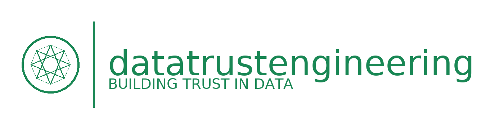

# Data Trust Engineering (DTE)

<p align="center">
  
</p>


[](https://github.com/datatrustengineering/DataTrustEngineering/stargazers)
[](https://github.com/datatrustengineering/DataTrustEngineering/watchers)
[](https://github.com/datatrustengineering/DataTrustEngineering/network/members)
[](https://github.com/datatrustengineering/DataTrustEngineering/issues)
[](LICENSE)

[](https://x.com/hashtag/DTERevolution)
[](https://join.slack.com/t/datatrustengineering/shared_invite/...)

**Data Trust Engineering (DTE)** is a vendor-neutral, engineering-first approach to building *trusted, AI-ready* data systems.  
This repo hosts the **Manifesto**, **Patterns**, and the **Trust Dashboard** MVP.

- 🌐 **Site**: https://datatrustmanifesto.org/
- 📜 **Manifesto**: [Manifesto.md](Manifesto.md)
- 🧭 **Patterns**: [docs/patterns/README.md](docs/patterns/README.md)
- 📊 **Trust Dashboard(s)**: [tools/data-trust-dashboard](tools/data-trust-dashboard)


**Data Trust Engineering (DTE)** is a community-driven approach that empowers data teams to build trusted, AI-ready systems through practical engineering patterns and open-source collaboration. Born from the *Data Trust Engineering Manifesto*, DTE provides actionable frameworks for certifying data systems by use case, risk, and value, blending DataOps principles with hands-on implementation. Our first artifact, the **DTE Trust Dashboard**, demonstrates real-time data and AI trust monitoring—more tools are coming from our community! Join us at [datatrustmanifesto.org](https://datatrustmanifesto.org) and fuel the #DTERevolution.

## Why DTE?

Traditional data governance often struggles with complexity, conflating compliance requirements with technical data management and creating barriers for engineering teams. Organizations face challenges when AI models encounter data quality issues or when scaling data trust across cloud environments. DTE addresses these practical challenges through:

- **Certification**: Practical validation patterns for datasets by use case, risk, and business value, supporting compliance goals indirectly.
- **Engineering Rigor**: Hands-on tools and patterns using Great Expectations, Apache Atlas, and other open-source frameworks.
- **AI-Readiness**: Proven approaches for fairness monitoring, drift detection, and model governance.
- **Cloud-Native**: Patterns that scale across data mesh architectures and hybrid cloud environments.
- **Community-Driven**: Open-source evolution through GitHub contributions and collaborative problem-solving.

DTE serves organizations of all sizes—from enterprises building regulatory reporting systems to SMBs seeking practical data trust solutions to data teams driving innovation with AI.

## Our First Artifact: DTE Trust Dashboard

The **DTE Trust Dashboard** demonstrates DTE principles in action, providing interactive visualization of AI trust metrics built with [Chart.js](https://www.chartjs.org) and [Plotly](https://plotly.com):

- **AI Fairness**: Demographic parity monitoring across protected attributes (integrates with Fairlearn).
- **Data Drift**: Real-time drift tracking and alerts (compatible with Evidently AI).
- **Model Performance**: Accuracy, F1 score, and AUC-ROC monitoring (integrates with MLflow).
- **Guardrails**: Multi-dimensional view of trust principles and safety metrics.

Find it in `/tools/data-trust-dashboard/`. This working dashboard serves as a foundation for community contributions and demonstrates how DTE patterns can be implemented in practice.

Explore [USE_CASES.md](/docs/patterns/USE_CASES.md) to see how DTE principles translate into actionable code examples.

## Getting Started

### Quick Start
1. **Clone the Repo**:
   ```bash
   git clone https://github.com/datatrustengineering/DataTrustEngineering.git
   cd DataTrustEngineering
   ```

### Live Demo
- **Trust Dashboard**: [Try it live](https://www.datatrustmanifesto.org/tools/data-trust-dashboard/dte_trust_dashboard/)
- **Full Site**: [datatrustmanifesto.org](https://datatrustmanifesto.org)

2. **Explore the Trust Dashboard**:
   - Navigate to `/tools/data-trust-dashboard`
   - Run the interactive Streamlit version: `streamlit run app.py`
   - View the static HTML version in any browser
   - Customize with your own data sources and metrics

3. **Read the Manifesto**:
   - See `/Manifesto.md` for DTE's core principles and philosophy.

4. **Integrate Tools**:
   - **Data Quality**: Great Expectations, Soda Core for validation
   - **Lineage**: Apache Atlas, OpenLineage for metadata tracking
   - **AI Governance**: Fairlearn, SHAP, MLflow for model monitoring

## Repository Structure

- `/Manifesto.md`: DTE's core philosophy and principles
- `/tools`: Working artifacts and code examples
- `/docs`: Patterns, guides, and practical implementations
- `/community`: Contribution guidelines and governance
- `/LICENSE.md`: MIT License for open collaboration

## Contributing

Help build the DTE ecosystem! Our community welcomes contributions that advance practical data trust engineering:

- **Artifacts**: Data quality tools, lineage trackers, or AI monitoring scripts in `/tools`
- **Patterns**: Documentation of proven approaches in `/docs/patterns`
- **Case Studies**: Real-world implementations and lessons learned
- **Code Examples**: Working implementations that others can fork and adapt

Start with "good first issues" or join our community discussions. See [CONTRIBUTING.md](/community/CONTRIBUTING.md) and [CODE_OF_CONDUCT.md](/community/CODE_OF_CONDUCT.md) for guidelines.

## Roadmap

- **Q4 2025**: Expand data quality patterns; add lineage tracking examples
- **Q1 2026**: Community case studies and real-world implementations
- **Q2 2026**: Enhanced documentation and contributor resources

## Why It Matters

DTE provides practical value through:

- **Proven Patterns**: Community-tested approaches for common data trust challenges
- **Engineering Focus**: Code-first solutions that integrate into existing workflows
- **Open Collaboration**: Shared knowledge and tools that benefit the entire ecosystem
- **Measurable Impact**: Demonstrated improvements in data quality and AI reliability

## License

[MIT License](/LICENSE.md) - encouraging open collaboration and reuse.


## Acknowledgments

**Authors**: Brian Brewer | Founder | https://www.infolibcorp.com

#DTERevolution


