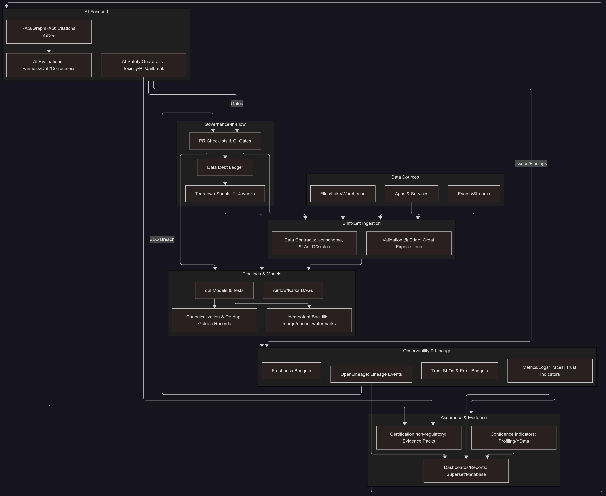

# Data Trust Engineering (DTE) Patterns

Welcome to the **Data Trust Engineering (DTE) Patterns Library**.  
This section is a **cookbook of practical patterns** — not policies, not frameworks.  
Each pattern includes **open-source code examples** you can fork, adapt, and extend.  

The goal is to provide a **baseline of engineering recipes** for building trusted data and AI systems.  
These are **not full-blown platforms** — they’re **guideposts and starting points** to help teams move beyond policy-heavy governance and focus on building **trust you can prove**.

---

## 📊 Core Data Trust Patterns

- [**Data Contracts**](./data-contracts/data-contracts.md) → Shift-left governance at ingestion with schema, rules, SLAs.  
- [**Data Quality Guide**](./data-quality/data-quality-guide.md) → Validation patterns, trust SLOs, confidence indicators.  
- [**Data Lineage**](./data-lineage/lineage.md) → Capture lineage with OpenLineage, make trust observable.  
- [**Data Pipelines**](./data-pipelines/data-pipelines.md) → Embed trust checks directly into Airflow/dbt pipelines.  
- [**Data Freshness**](./data-freshness/data-freshness.md) → Freshness budgets + graceful degradation strategies.  
- [**Certification**](./certification/certification.md) → Practical, non-regulatory assurance through automated checks.  
- [**Confidence Indicators**](./confidence-indicators/confidence-indicators.md) → Profiling and publishing trust signals alongside dashboards.  

---

## 🤖 AI-Focused Patterns

- [**AI Evaluations**](./ai-evals/ai-evals.md) → Fairness, drift, robustness, correctness — evidence packs, not theater.  
- [**AI Safety**](./ai-safety/ai-safety.md) → Guardrails against toxicity, PII leakage, hallucinations, jailbreaks.  

---

## 🔍 Observability & Reliability

- [**Observability**](./observability/observability.md) → Telemetry tied to trust indicators.  
- [**Trust SLOs**](./trust-slo/trust-slo.md) → SLAs/SLOs + error budgets for freshness, null %, contract violations.  
- [**Error Budgeting**](./error-budgeting/error-budgeting.md) → Tie observability metrics to delivery prioritization.  

---

## 🧹 Managing Data Debt

- [**Data Debt Guide**](./data-debt/data-debt.md) → Patterns for making debt visible, measurable, and payable.  
- [**Data Debt Ledger**](./data-debt/data-debt-ledger.md) → Lightweight git-tracked debt inventory.  
- [**Teardown Sprints**](./teardown-sprints/teardown.md) → Focused cleanup to reduce DAG depth, unused models, dead code.  

---

## 🧪 Testing & Canonicalization

- [**Test Pyramid for Data**](./test-pyramid-for-data/test-pyramid.md) → Balance unit/integration/e2e trust tests.  
- [**Backfills**](./backfills/backfills.md) → Idempotent backfill strategies (merge/upsert, watermarks).  
- [**Canonicalization**](./canonicalization/canonicalization.md) → Golden records, de-duplication, entity resolution.  
- [**Profiling**](./profiling/profiling.md) → Lightweight profiling with YData for confidence indicators.  

---

## How to Use These Patterns

1. **Pick a Pattern** → Start small (e.g., add freshness checks or contracts at ingestion).  
2. **Fork & Adapt** → Use the open-source examples, swap in your stack.  
3. **Contribute** → Extend a pattern or propose a new one via PR.  

---

## Why This Matters

Traditional data governance frameworks are **70–85% failure-prone** because they focus on policy and bureaucracy instead of engineering.  
**DTE Patterns** flip the script: they’re **code-first, open-source, risk-tiered**.  

This library is the **engineering playbook for trust** — a practical alternative to governance theater.  

---

## Visual Map: DTE Patterns

  
  <figcaption style="margin-top: 1rem; font-style: italic; color: #666; font-size: 0.9rem;">
    Data Trust Engineering pattern flow: From data sources through AI assurance with community-driven patterns
  </figcaption>

---

## Pattern Guides

| Pattern | File | Description |
|---------|------|-------------|
| **AI Evaluations** | [ai-evals.md](ai-evals/ai-evals.md) | Risk-tiered evals (fairness, drift, robustness, correctness) with evidence packs. |
| **AI Safety** | [ai-safety.md](ai-safety/ai-safety.md) | Guardrails at generation: toxicity, PII, jailbreak, hallucination checks. |
| **Backfills** | [backfills.md](backfills/backfills.md) | Idempotent backfill strategies (merge/upsert, watermarking). |
| **Canonicalization** | [canonicalization.md](canonicalization/canonicalization.md) | Golden records & entity resolution to eliminate duplicates. |
| **Certification** | [certification.md](certification/certification.md) | Non-regulatory certification artifacts for trust by use case, risk, and value. |
| **Confidence Indicators** | [confidence-indicators.md](confidence-indicators/confidence-indicators.md) | Profiling + publishing trust metrics (completeness %, duplication %, freshness). |
| **Dashboards & Reports** | [dashboards.md](dashboards-reports/dashboards.md) | Visualizing trust metrics with Superset/Metabase. |
| **Data Contracts** | [data-contracts.md](data-contracts/data-contracts.md) | Shift-left schema & SLA enforcement at ingestion. |
| **Data Debt (Overview)** | [data-debt.md](data-debt/data-debt.md) | Patterns for managing technical/data debt as a budget. |
| **Data Debt Ledger** | [data-debt-ledger.md](data-debt/data-debt-ledger.md) | Git-tracked ledger to record and track debt items. |
| **Data Freshness** | [data-freshness.md](data-freshness/data-freshness.md) | Freshness & staleness budgets, dbt source freshness, graceful degradation. |
| **Data Lineage** | [lineage.md](data-lineage/lineage.md) | OpenLineage integration for CI/CD blast radius + lineage visibility. |
| **Data Pipelines** | [data-pipelines.md](data-pipelines/data-pipelines.md) | Trust checks embedded in Airflow/Kafka DAGs. |
| **Data Quality Guide** | [data-quality-guide.md](data-quality/data-quality-guide.md) | Shift-left expectations, dbt tests, trust SLOs, profiling. |
| **Error Budgeting** | [error-budgeting.md](error-budgeting/error-budgeting.md) | Linking trust SLOs with observability + enforcement. |
| **Observability** | [observability.md](observability/observability.md) | Metrics/logs/traces tied to trust indicators. |
| **Profiling** | [profiling.md](profiling/profiling.md) | Profiling datasets with YData Profiling, publishing confidence indicators. |
| **Teardown Sprints** | [teardown.md](teardown-sprints/teardown.md) | 2–4 week cycles to simplify, remove dead code, reduce DAG depth. |
| **Test Pyramid for Data** | [test-pyramid.md](test-pyramid-for-data/test-pyramid.md) | Balance of unit, integration, and end-to-end data tests. |
| **Trust SLOs** | [trust-slo.md](trust-slo/trust-slo.md) | Defining trust SLAs/SLOs (null %, freshness p95, contract violations). |

---

## How to Navigate

- **Start Here**: [USE_CASES.md](../USE_CASES.md) for context + baseline examples.  
- **Anchor Artifact**: [Trust Dashboard](../tools/data-trust-dashboard/README.md) — shows DTE principles in action.  
- **Explore Patterns**: Each file above has code snippets + open-source recipes you can fork.  

---

#DataTrustCommunity